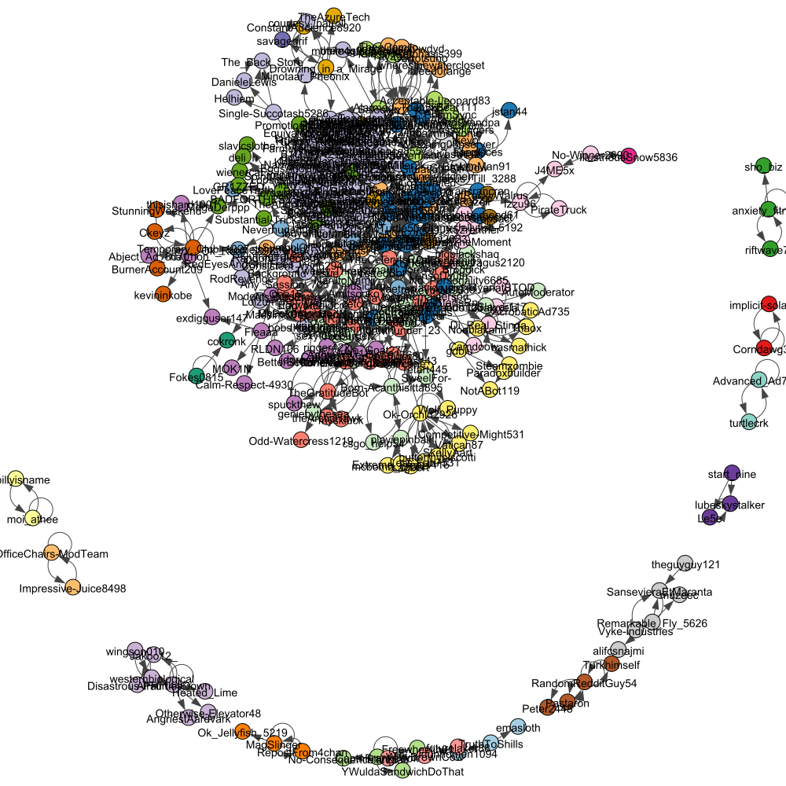
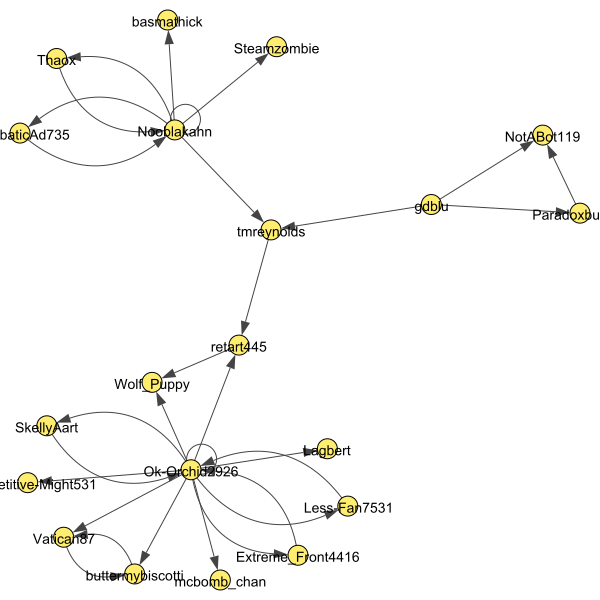
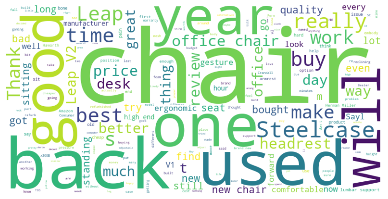

# social-media-analytics-using-reddit
using Reddit conversations to identify communities and topic of discussion in those community

In this project, I have taken the group where people are speaking about Ergonomic chairs. I have used top 100 posts and created a graph of how members are communicating.

The overall graph looks like this, where each colour is a community

To show one of the communities:

The word cloud shows what this particular community is discussing on

The Report.pdf file also speaks of the influencers, in these commnuities and the ways to identify them.

